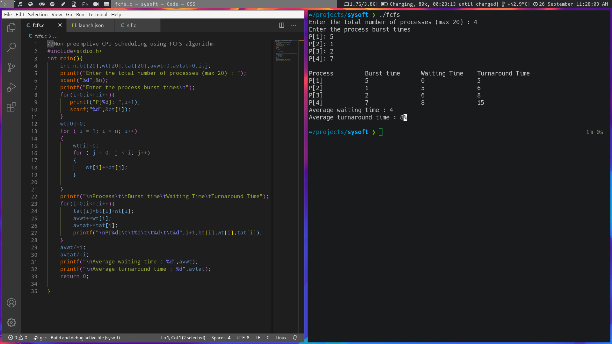
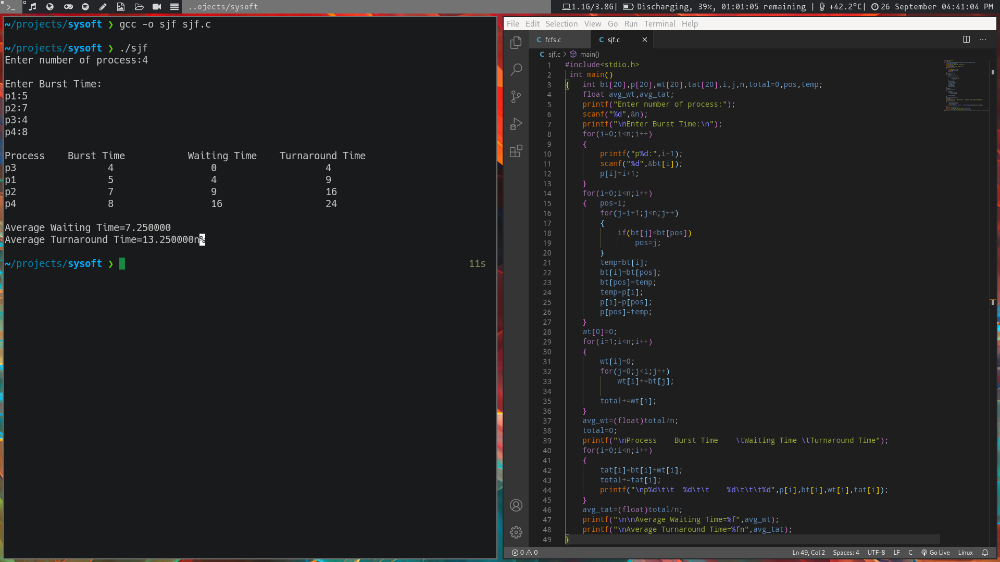

# Program 1

## Write a C program to simulate the non-pre-emptive CPU scheduling algorithms for finding turnaround time and waiting time

- First Come First Serve (FCFS)

- Shortest Job First (SJF)

Non pre emptive CPU scheduling using FCFS

Non pre emptive CPU scheduling using SJF

