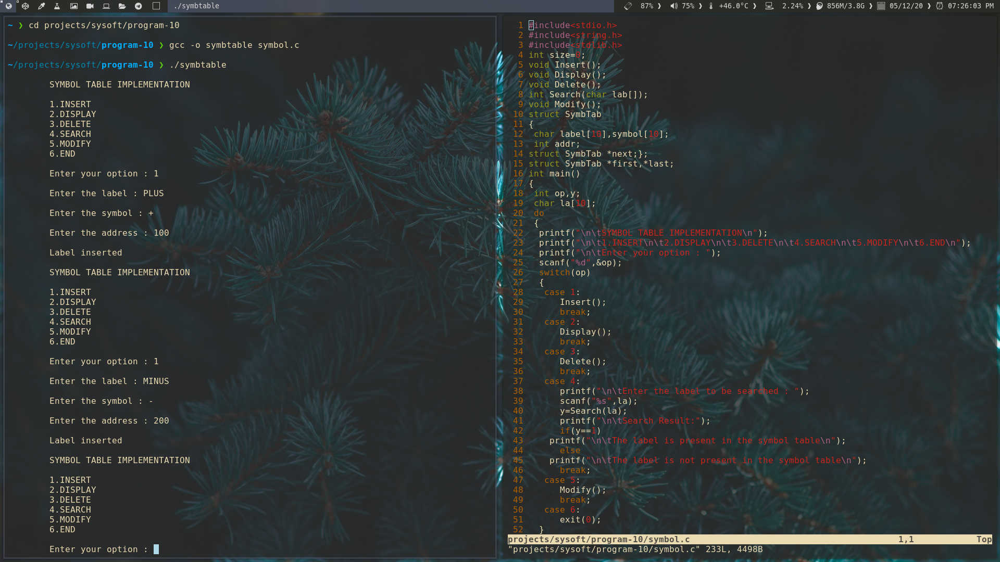
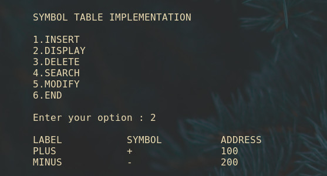
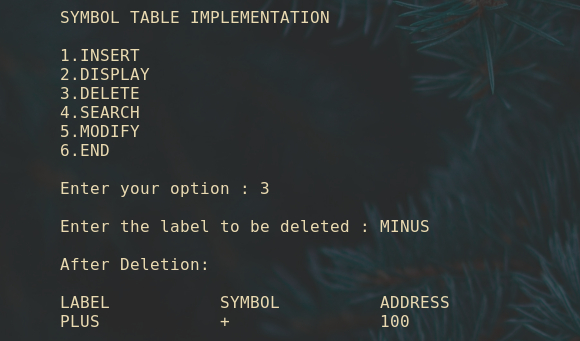
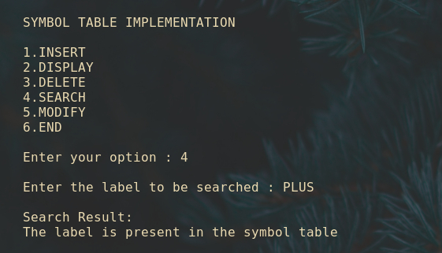
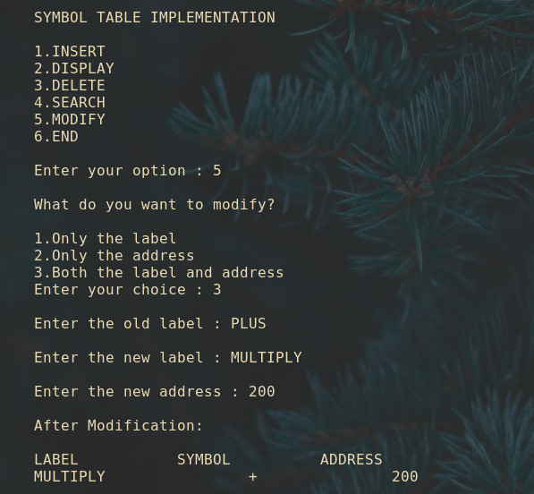

## Symbol Table functions

Implement the symbol table functions create, insert, modify, search and display.

### Output 

[Source code](symbol.c)

- Insertion

- Display

- Deletion

- Search

- Modification

