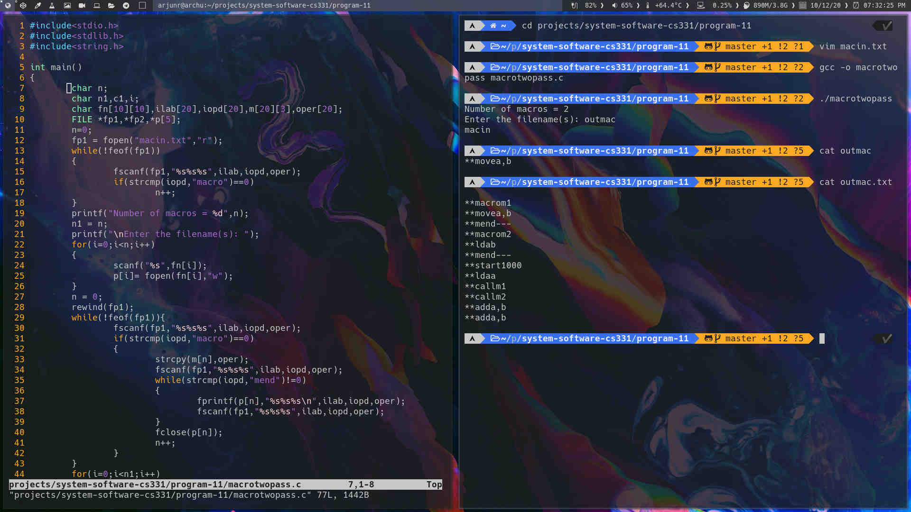

## Two pass macro processor

Implement a twopass macro processor.

A general-purpose macro processor or general purpose preprocessor is a macro processor that is not tied to or integrated with a particular language or piece of software. A macro processor is a program that copies a stream of text from one place to another, making a systematic set of replacements as it does so. Macro processors are often embedded in other programs, such as assemblers and compilers. Sometimes they are standalone programs that can be used to process any kind of text. Macro processors have been used for language expansion (defining new language constructs that can be expressed in terms of existing language components), for systematic text replacements that require decision making, and for text reformatting (e.g. conditional extraction of material from an HTML file).

## Output

[Source code](macrotwopass.c)

### Output screenshots

