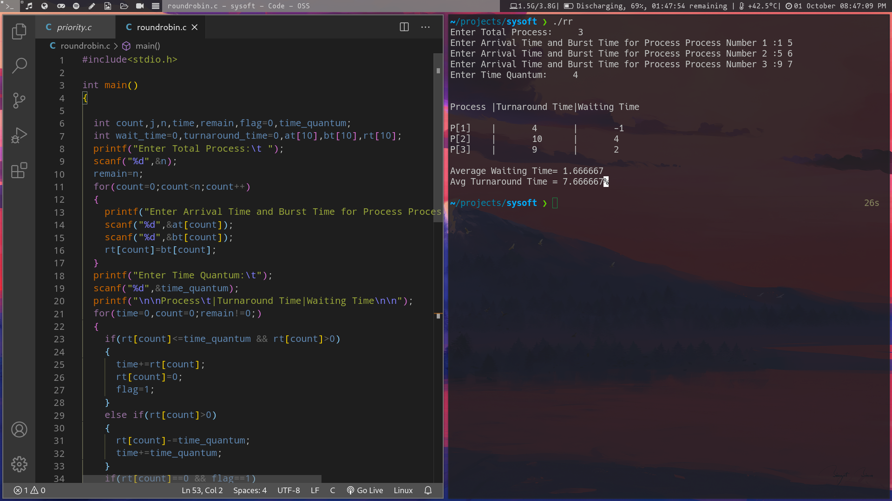
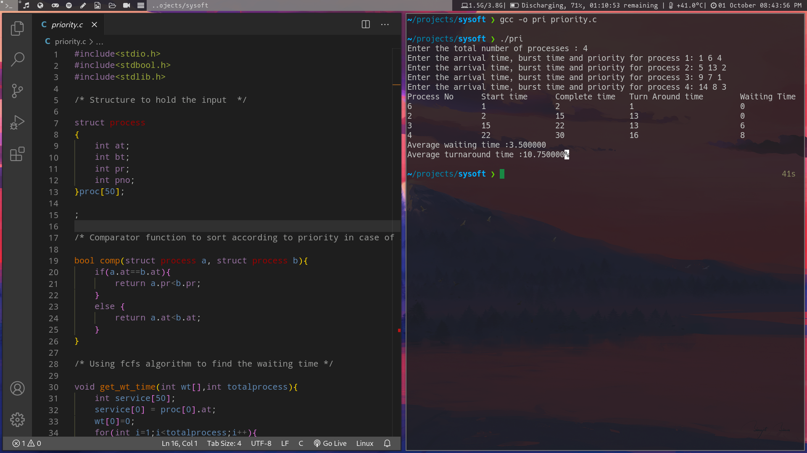

# Program 2

### Simulate the following non-preempitve cpu scheduling algorthms to find turnaround time and waiting time

- Round robin (pre-emptive)

- Priority Scheduling

Round robin (pre-emptive)

Priority Scheduling

