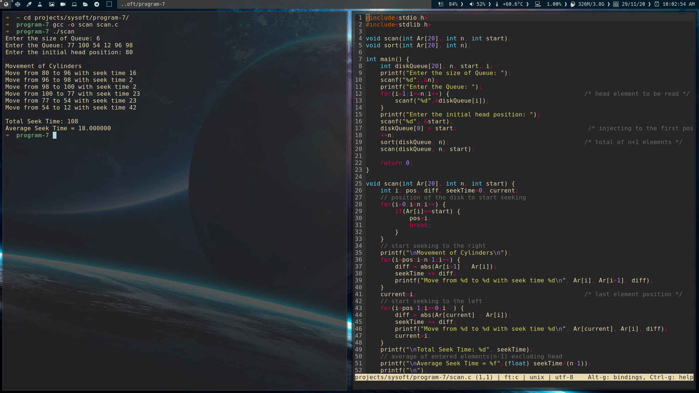

### Disk scheduling algorithms

Simulate the following disk scheduling algorithms
- FCFS
- SCAN
- C-SCAN

### FCFS

[Source code](fcfs.c)

Output screenshot

### SCAN

[Source code](scan.c)

Output screenshot

### C-SCAN

[Source code](cscan.c)

Output screenshot

