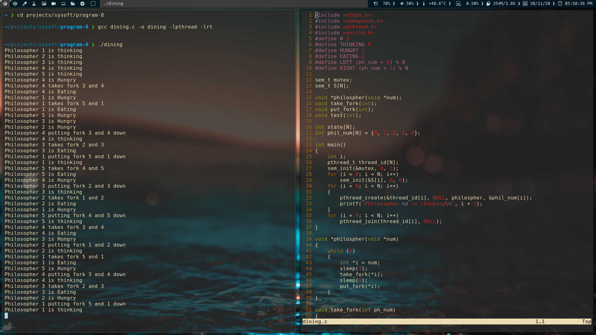

## Dining Philsopher's problem

The dining philosophers problem states that there are 5 philosophers sharing a circular table and they eat and think alternatively. There is a bowl of rice for each of the philosophers and 5 forks. A philosopher needs both their right and left fork to eat. A hungry philosopher may only eat if there are both forks available.Otherwise a philosopher puts down their fork and begin thinking again.

The dining philosopher is a classic synchronization problem as it demonstrates a large class of concurrency control problems.

### Solution

[Source cdde](dining.c)

A solution of the Dining Philosophers Problem is to use a semaphore to represent a fork. A fork can be picked up by executing a wait operation on the semaphore and released by executing a signal semaphore.

	sem_t S[N];

Initially the elements of the fork are initialized to 1 as the forks are on the table and not picked up by a philosopher.
The structure of a random philosopher i is given as follows −

	do {
	   wait( fork[i] );
	   wait( fork[ (i+1) % 5] );
	   . .
	   . EATING THE RICE
	   .
	   signal( fork[i] );
	   signal( fork[ (i+1) % 5] );
	   .
	   . THINKING
	   .
	} while(1);

In the above structure, first wait operation is performed on fork[i] and fork[ (i+1) % 5]. This means that the philosopher i has picked up the forks on his sides. Then the eating function is performed.
After that, signal operation is performed on fork[i] and fork[ (i+1) % 5]. This means that the philosopher i has eaten and put down the fork on his sides. Then the philosopher goes back to thinking.

The above solution makes sure that no two neighboring philosophers can eat at the same time. But this solution can lead to a deadlock. This may happen if all the philosophers pick their left fork simultaneously. Then none of them can eat and deadlock occurs.

Some of the ways to avoid deadlock are as follows 

- There should be at most four philosophers on the table.
- An even philosopher should pick the right fork and then the left fork while an odd philosopher should pick the left fork and then the right fork.
- A philosopher should only be allowed to pick their fork if both are available at the same time.

### Output Screenshot

